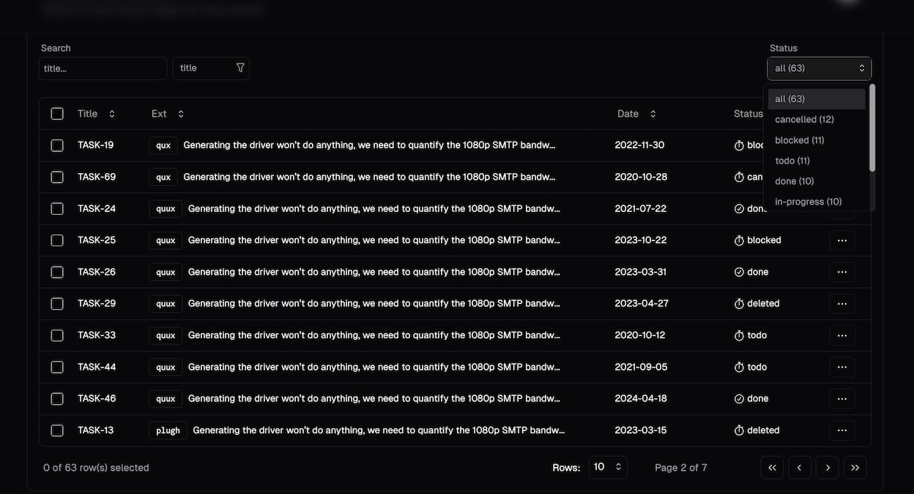
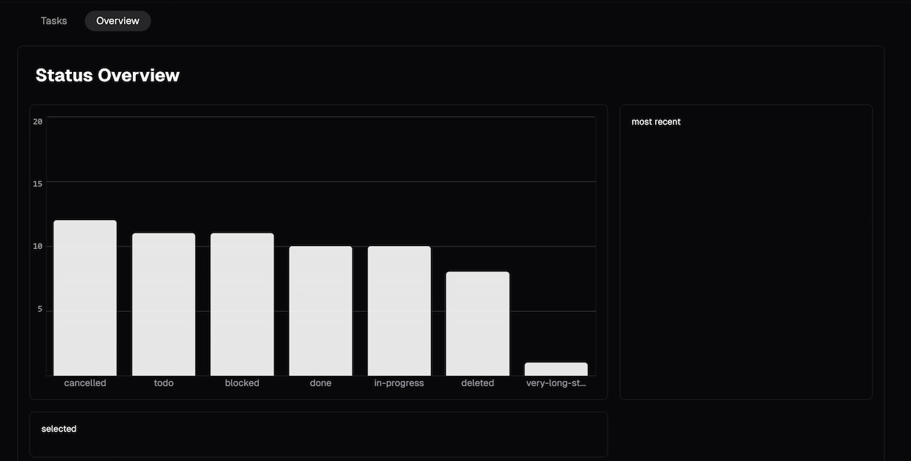

### Local task-manager (work in progress)
<!-- image -->


<!-- image2 -->


---

### Running

initialize -- in root dir
```bash
npm install
npm i -g json-server
```

**ensure db.json is in root directory**
Open two terminals:

#### Terminal 1.
```bash
npm run server:dev
# or use production server (compressed json ect.)
npm run server:prod
```

#### Terminal 2.
**If developing**
```bash
npm run dev
```

**If building**
```bash
npm run build
npm run build:server
```
